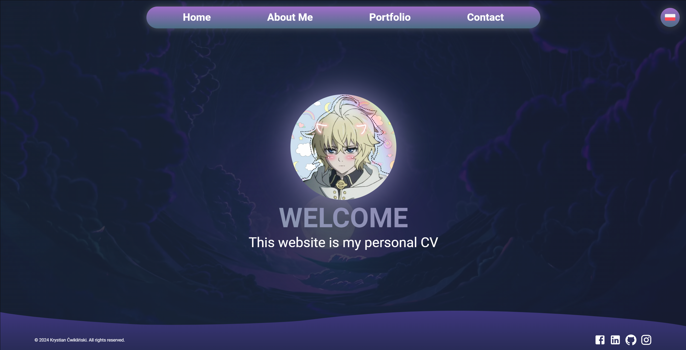

<a id="readme-top"></a>


<!-- PROJECT SHIELDS -->
<div align="center">

[![Stargazers][stars-shield]][stars-url]
[![Issues][issues-shield]][issues-url]
[![MIT License][license-shield]][license-url]
[![LinkedIn][linkedin-shield]][linkedin-url]

</div>


<!-- PROJECT LOGO -->
<br />
<div align="center">
  <a href="https://github.com/weebik/weebsite">
    
  </a>

<h3 align="center">weebsite</h3>
  <p align="center">
    This is my personal fullstack project that serves as my web CV.
    <br />
    <br />
    <a href="https://weebsitecv.vercel.app">Visit</a>
    ·
    <a href="https://github.com/weebik/weebsite/issues/new?assignees=&labels=&projects=&template=bug_report.md&title=">Report Bug</a>
    ·
    <a href="https://github.com/weebik/weebsite/issues/new?assignees=&labels=&projects=&template=feature_request.md&title=">Request Feature</a>
  </p>
</div>


<!-- TABLE OF CONTENTS -->
<details>
  <summary>Table of Contents</summary>
  <ol>
    <li>
      <a href="#about-the-project">About The Project</a>
      <ul>
        <li><a href="#built-with">Built With</a></li>
        <li><a href="#communication">Communication</a></li>
        <li><a href="#structure">Project Structure</a></li>
      </ul>
    </li>
    <li>
      <a href="#contributing">Contributing</a>
      <ul>
        <li><a href="#reporting-issues">Reporting issues</a></li>
        <li><a href="#suggesting-improvements">Suggesting improvements</a></li>
      </ul>
    </li>
    <li><a href="#license">License</a></li>
    <li><a href="#contact">Contact</a></li>
    <li><a href="#todos">Todo</a></li>
  </ol>
</details>


<!-- ABOUT THE PROJECT -->
## About The Project

This project is built with React framework using TypeScript. Some components are from MaterialUI and the styles are written in pure css. The backend and CMS is based on Strapi with various plugins like Internationalization and EmailPlugin. Frontend is deployed on Vercel, backend is deployed on Render. The backend has been linked to Supabase Database that stores content of the website.

<p align="right">(<a href="#readme-top">back to top</a>)</p>


### Built With
[![React][React.js]][React-url]
[![Typescript][Typescript]][Typescript-url]
![CSS][CSS3]
[![Strapi][Strapi]][Strapi-url]
[![MUI][MUI]][MUI-url]
[![Vercel][Vercel]][Vercel-url]
[![Render][Render]][Render-url]
[![Supabase][Supabase]][Supabase-url]

<p align="right">(<a href="#readme-top">back to top</a>)</p>

### Communication
<div align="center">
  
</div>

### Project Structure

```
weebsite/
├── backend/
│   ├── public/
│   ├── src/
│   │   └── api/
│   └── types/
└── frontent/
    ├── public/
    ├── src/
    │   ├── assets/
    │   ├── components/
    │   ├── hooks/
    │   ├── layout/
    │   ├── pages/
    │   ├── routes/
    │   ├── styles/
    │   ├── types/
    │   ├── utils/
    │   ├── App.tsx
    │   ├── index.css
    │   └── main.tsx
    └── index.html
```

<p align="right">(<a href="#readme-top">back to top</a>)</p>

<!-- CONTRIBUTING -->
## Contributing
Thank you for your interest in contributing to my project! Your feedback and suggestions are invaluable in making this app better. Below are some ways you can contribute:

<p align="right">(<a href="#readme-top">back to top</a>)</p>

### Reporting Issues  
If you find any bugs or issues, please let me know by creating a [GitHub issue](https://github.com/weebik/weebsite/issues/new?assignees=&labels=&projects=&template=bug_report.md&title=). When reporting, try to include:  
- A clear description of the issue.  
- Steps to reproduce the problem.  
- Screenshots or error messages, if applicable.  

<p align="right">(<a href="#readme-top">back to top</a>)</p>

### Suggesting Improvements  
Your ideas on how to improve the project are always welcome! Feel free to:  
- Suggest ways to optimize the code for better performance.  
- Propose changes to make the code more readable and maintainable.  
- Recommend new features or enhancements that align with the project's goals. You can do that via [Request feature](https://github.com/weebik/weebsite/issues/new?assignees=&labels=&projects=&template=feature_request.md&title=) form.

<p align="right">(<a href="#readme-top">back to top</a>)</p>

<!-- LICENSE -->
## License
- Backend uses the **MIT Expo** license. Details in [LICENSE](https://github.com/weebik/weebsite/blob/main/backend/LICENSE.txt).
- Frontend uses the **MIT** license. Details in [LICENSE](https://github.com/weebik/weebsite/blob/main/frontend/LICENSE.txt).
- **The content of the site (e.g. texts, media) is my property** and cannot be copied without my permission. The exception is the background video animation, which belongs to [4k SCREENSAVERS](https://www.youtube.com/@4kSCREENSAVERS).


<p align="right">(<a href="#readme-top">back to top</a>)</p>


<!-- CONTACT -->
## Contact

Krystian Ćwikliński - krystian.samaa@gmail.com

Project Link: [https://github.com/weebik/weebsite](https://github.com/weebik/weebsite)

<p align="right">(<a href="#readme-top">back to top</a>)</p>


<!-- ACKNOWLEDGMENTS -->
## Todo

* Improvments in mobile views and responsiveness
* Some style changes (animations, icons)
* Fix image carousel on page load
* Code refactor
* React hook form (?)

<p align="right">(<a href="#readme-top">back to top</a>)</p>


<!-- MARKDOWN LINKS & IMAGES -->
<!-- https://www.markdownguide.org/basic-syntax/#reference-style-links -->
[contributors-shield]: https://img.shields.io/github/contributors/weebik/weebsite.svg?style=for-the-badge
[contributors-url]: https://github.com/weebik/weebsite/graphs/contributors
[forks-shield]: https://img.shields.io/github/forks/weebik/weebiste.svg?style=for-the-badge
[forks-url]: https://github.com/weebik/weebsite/network/members
[stars-shield]: https://img.shields.io/github/stars/weebik/weebsite.svg?style=for-the-badge
[stars-url]: https://github.com/weebik/weebsite/stargazers
[issues-shield]: https://img.shields.io/github/issues/weebik/weebsite.svg?style=for-the-badge
[issues-url]: https://github.com/weebik/weebsite/issues
[license-shield]: https://img.shields.io/badge/License-MIT-yellow.svg?style=for-the-badge
[license-url]: https://img.shields.io/github/license/weebik/weebsite%2Ffrontend%2FLICENSE.TXT
[linkedin-shield]: https://img.shields.io/badge/-LinkedIn-black.svg?style=for-the-badge&logo=linkedin&colorB=555
[linkedin-url]: https://linkedin.com/in/linkedin_username
[product-screenshot]: images/screenshot.png
[Next.js]: https://img.shields.io/badge/next.js-000000?style=for-the-badge&logo=nextdotjs&logoColor=white
[Next-url]: https://nextjs.org/
[React.js]: https://img.shields.io/badge/react-%2320232a.svg?style=for-the-badge&logo=react&logoColor=%2361DAFB
[React-url]: https://reactjs.org/
[Typescript]: https://img.shields.io/badge/typescript-%23007ACC.svg?style=for-the-badge&logo=typescript&logoColor=white
[Typescript-url]: https://www.typescriptlang.org
[CSS3]: https://img.shields.io/badge/css3-%231572B6.svg?style=for-the-badge&logo=css3&logoColor=white
[Strapi]: https://img.shields.io/badge/strapi-%232E7EEA.svg?style=for-the-badge&logo=strapi&logoColor=white
[Strapi-url]: https://strapi.io
[MUI]: https://img.shields.io/badge/MUI-%230081CB.svg?style=for-the-badge&logo=mui&logoColor=white
[MUI-url]: https://mui.com/material-ui/
[Vercel]:https://img.shields.io/badge/vercel-%23000000.svg?style=for-the-badge&logo=vercel&logoColor=white
[Vercel-url]:https://vercel.com
[Render]:https://img.shields.io/badge/Render-%46E3B7.svg?style=for-the-badge&logo=render&logoColor=white
[Render-url]:https://render.com
[Supabase]:https://img.shields.io/badge/Supabase-3ECF8E?style=for-the-badge&logo=supabase&logoColor=white
[Supabase-url]:https://supabase.com